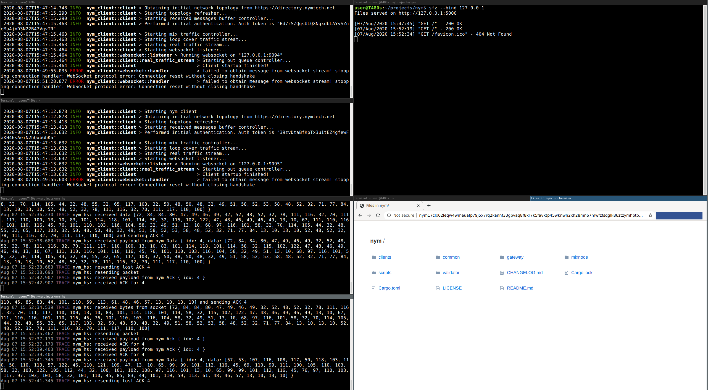

# Nym Hidden Service Protocol

**This software ist pre-alpha and crashes a lot. The first connection works normally though. I'm slowly addressing all
the `unwrap`s leading to this behavior. Any fixes and improvements are welcome.**

This repo contains an implementation of a TCP-based hidden service protocol built on [Nym](https://github.com/nymtech).
It consists of two parts:

* A socks5 server which is used as a client. Any application that can use socks5 can be used with this hidden service
client.
* A hidden service server, which waits for incoming connections from the nym daemon and forwards them over TCP sockets
to the specified target service

The protocol is currently very slow as it has to implement a reliable transport layer, a bit like TCP, to work around
Nym's current reliability issues. To keep this proof of concept simple it uses a naive algorithm not optimized for
latency or throughput at all. This may change in the future.

Assuming two nym clients are running on port 9094 and 9095 this will run the socks proxy on port 9090 and connect to a 
service on port 5000:
```bash
$ RUST_LOG=socks_server=trace,nym_hs=trace cargo run --bin socks_server -- ws://127.0.0.1:9094

$ RUST_LOG=nym_hs=trace,hs_server=trace cargo run --bin hs_server ws://127.0.0.1:9095 127.0.0.1:5000
Listening: nym17clx02leqw4wmeuafp79j5x7rq2kannf33gpvaq8f8kr7k5favktp45wknwh2xh28mn67mwfzfsqglk86ztzymhptpmf9f95ktlu2vgn2nq9z.nym
```

Below you see chromium loading the directory index of the nym project via this protocol. It took nearly one minute and
a few tries but worked in the end.
